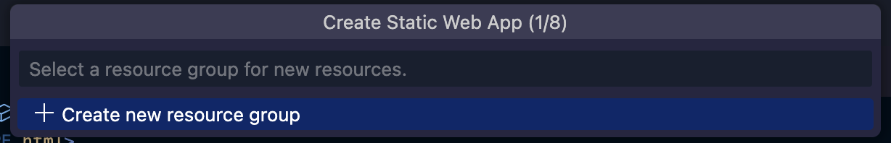
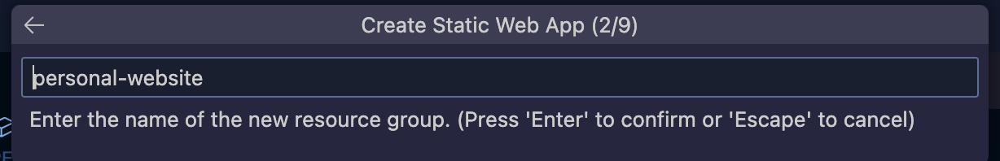
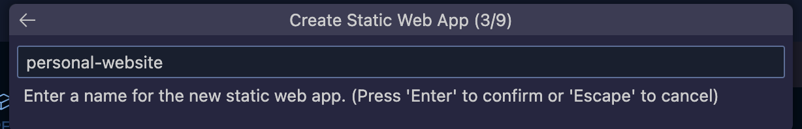
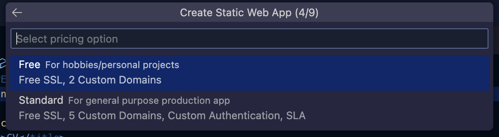
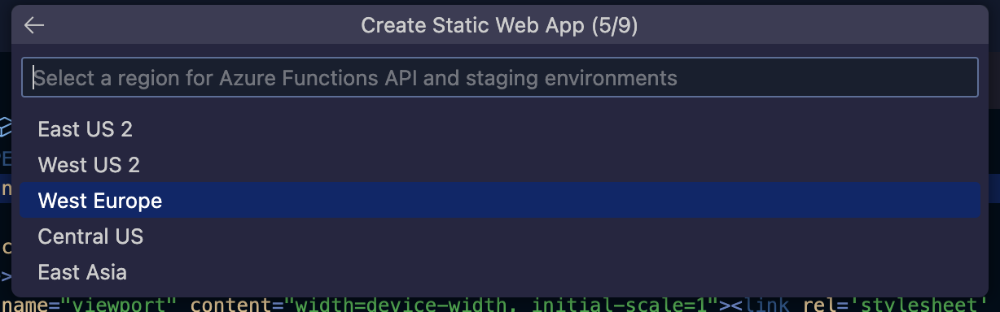
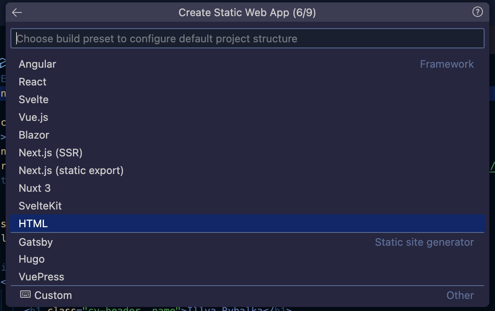
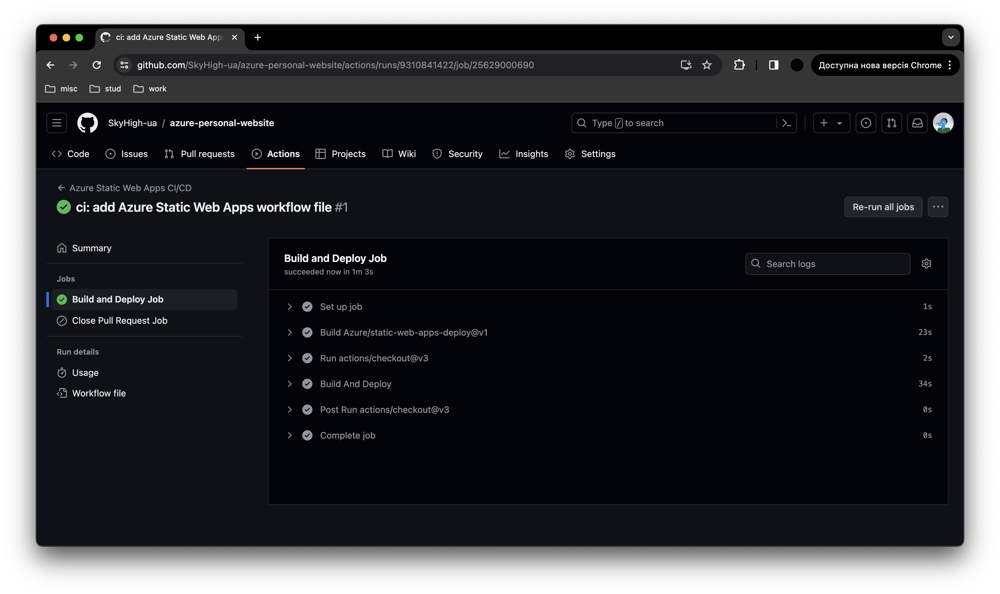
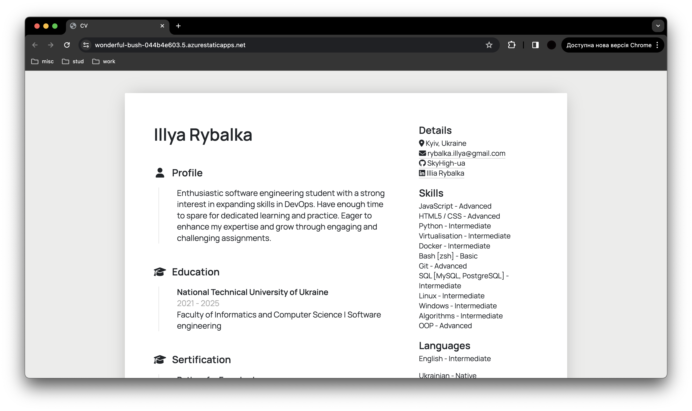

# Creating an Azure Static Web App with Azure App Services using VS Code

## Prerequisites
1. **Azure Subscription**: Ensure you have an active Azure subscription.
2. **VS Code**: Install [Visual Studio Code](https://code.visualstudio.com/).
3. **Azure Tools Extension for VS Code**: Install the Azure Static Web Apps extension in VS Code.
4. **GitHub Repository**: Required for GitHub Actions, which will deploy the app.
5. **Logged In**: Ensure you are logged into Azure and GitHub, and working from a local clone of your repository in VS Code.

## Step-by-Step Guide

### 1. Create a Static Web App in Azure
- Open the command palette and type `Azure Static Web Apps: Create Static Web App...`.
- Follow the prompts to create the Static Web App:
  - **Resource Group**: Create a new resource group or select an existing one.
  
  - **Resource Group Name (Optional)**: Provide a unique name for new resource group.
  
  - **Name**: Provide a unique name for your Static Web App.
  
  - **Subscription**: Select your Azure subscription.
  
  - **Region**: Choose a region close to your users.
  
  - **Framework**: Select the framework you are using (e.g., `React`, `Angular`, `Vue.js`, etc.), in this case `HTML`.
  
  - **App location**: Specify the location of your app, in this case `/`.
  - **API location**: If you have an Azure Functions API, specify its location. Otherwise, leave it blank.
  - **Output location**: Specify the build output location. Otherwise, leave it blank.

### 2. Deploy and View Your Static Web App
- Wait until the Static Web App service is created in Azure.

- After the GitHub Actions workflow completes, your app will be deployed. You can monitor the deployment process from the Actions tab in your GitHub repository.

- Once the deployment is complete, you can view your static web app at the provided [URL](https://wonderful-bush-044b4e603.5.azurestaticapps.net/).
